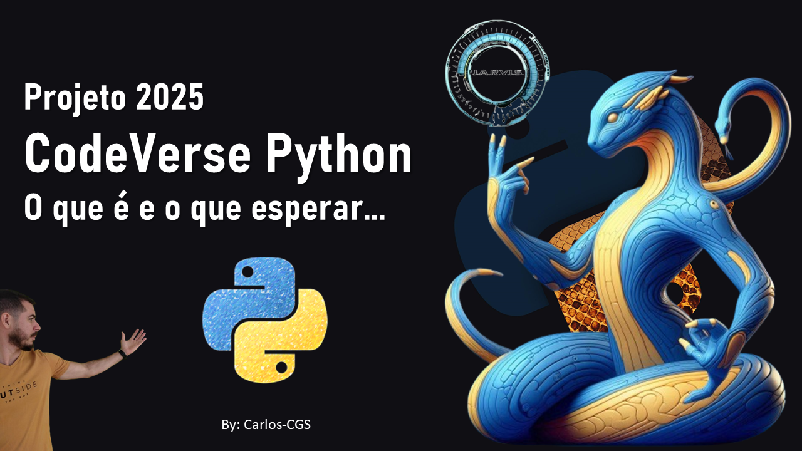

# 🌌 Projeto CodeVerse Python 2025

**Seja muito bem-vindo(a) ao universo do CodeVerse Python 2025!**  
Aqui, a missão é clara: **tornar o aprendizado de Python simples, divertido e cheio de referências ao universo Marvel** — afinal, quem disse que programar precisa ser chato?

Sou um desenvolvedor em constante evolução, **não um especialista**, mas um eterno aprendiz que adora mergulhar em códigos, criar projetos criativos e, principalmente, compartilhar tudo isso com a comunidade. Essa jornada é feita de curiosidade, tentativas, erros, acertos... e muita paixão por tecnologia.

---

## 📖 Sobre o Projeto
O CodeVerse Python 2025 é um projeto que nasceu da vontade de mostrar que qualquer pessoa pode aprender Python — desde que tenha alguém explicando com carinho, paciência e boas analogias (e é aí que entra meu amor pelo universo Marvel! 🦸‍♂️✨).

Toda segunda-feira às 07:00h, você vai encontrar aqui um novo artigo publicado no LinkedIn com explicações diretas ao ponto, exemplos práticos e comparações com personagens e conceitos da Marvel para tornar tudo mais visual e fácil de entender.

## 🚀 O que você encontra por aqui:

- **📚 Artigos organizados**  
  Links de todos os conteúdos já publicados no LinkedIn.

- **💻 Códigos-fonte**  
  Projetos práticos e exemplos comentados usados nos artigos.

- **🤖 Projetos desafiadores**  
  Como o J.A.R.V.I.S., um assistente virtual inspirado no Homem de Ferro, recriado em Python!

Se você é fã da Marvel, está aprendendo Python ou simplesmente ama tecnologia, **esse projeto é pra você**.  
Vamos juntos, um commit por vez, conquistar esse universo de possibilidades chamado programação. 💡🚀

---

## 🗓️ Cronograma de Publicações

| Data       | Artigo                                            | Link                                                                                                                                                                                       |
| ---------- | ------------------------------------------------------- | ------------------------------------------------------------------------------------------------------ |
| 06/01/2025 | Introdução ao Projeto CodeVerse Python 2025 | [# 01 - CODEVERSE PYTHON](https://www.linkedin.com/posts/carlos-cgs_codeverse-python-disseminarconhecimentos-activity-7281972811693252608-9Qk3?utm_source=share&utm_medium=member_desktop)   |
| 13/01/2025 | O que é Lógica de Programação e Qual a sua Importância! | [# 02 - CODEVERSE PYTHON](https://www.linkedin.com/posts/carlos-cgs_codeverse-python-disseminarconhecimentos-activity-7284509493529300994-izDr?utm_source=share&utm_medium=member_desktop) |
| 20/01/2025 | O que é uma IDE e por que utilizá-la? | [# 03 - CODEVERSE PYTHON](https://www.linkedin.com/posts/carlos-cgs_codeverse-python-disseminarconhecimentos-activity-7287046246328885249-6la8?utm_source=share&utm_medium=member_desktop)   |
| 27/01/2025 |  Introdução à Linguagem Python | [# 04 - CODEVERSE PYTHON](https://www.linkedin.com/posts/carlos-cgs_codeverse-python-disseminarconhecimentos-activity-7289583053616607232-dzcj?utm_source=share&utm_medium=member_desktop)  |
| 03/02/2025 | Indentação e Tipos de Dados no Python | [# 05 - CODEVERSE PYTHON](https://www.linkedin.com/pulse/05-indenta%C3%A7%C3%A3o-e-tipos-de-dados-python-carlos-garcia-cgs-z9ngf/?trackingId=LsllBvwkYeZu5JG%2BR%2B02OA%3D%3D)         |
| 10/02/2025 | Operadores Aritméticos e Comentários no Python | [# 06 - CODEVERSE PYTHON](https://www.linkedin.com/pulse/06-operadores-aritm%C3%A9ticos-e-coment%C3%A1rios-python-carlos-garcia-cgs-eembf/?trackingId=rb9xbKEnQS%2BPW0KiLMjppQ%3D%3D)         |
| 17/02/2025 | Operadores Lógicos e Relacionais com Python | [# 07 - CODEVERSE PYTHON](https://www.linkedin.com/pulse/operadores-l%C3%B3gicos-e-relacionais-com-python-carlos-garcia-cgs-fnv9f/?trackingId=UCqSouCs%2FGKVkQgyhoq1Tw%3D%3D)         |
| 24/02/2025 | Vamos Falar Sobre Listas em Python | [# 08 - CODEVERSE PYTHON](https://www.linkedin.com/pulse/08-vamos-falar-sobre-listas-em-python-carlos-garcia-cgs-u2c6f/?trackingId=Dw5hbP20f5iD6Ey8EMLVfw%3D%3D)     |
| 03/03/2025 | Manipulando Listas em Python | [# 09 - CODEVERSE PYTHON](https://www.linkedin.com/posts/carlos-cgs_codeverse-python-disseminarconhecimentos-activity-7302266510712963072-eaJ0?utm_source=share&utm_medium=member_desktop&rcm=ACoAAEyge1cBtl8d4Noh69HabZFN9Dk1emNWjUI)         |
| 10/03/2025 | Estruturas de Controle / Decisão com Python! | [# 10 - CODEVERSE PYTHON](https://www.linkedin.com/posts/carlos-cgs_codeverse-python-disseminarconhecimentos-activity-7304803216624422912-gcSV?utm_source=share&utm_medium=member_desktop&rcm=ACoAAEyge1cBtl8d4Noh69HabZFN9Dk1emNWjUI)         |
| 17/03/2025 | O Poder dos Loops em Python - Parte 1 🔄 | [# 11 - CODEVERSE PYTHON](https://www.linkedin.com/posts/carlos-cgs_codeverse-python-disseminarconhecimentos-activity-7307339949555511298-nbCh?utm_source=share&utm_medium=member_desktop&rcm=ACoAAEyge1cBtl8d4Noh69HabZFN9Dk1emNWjUI)         |
| 24/03/2025 | Loops de Repetição While & Loop Aninhado - Parte 2 | [# 12 - CODEVERSE PYTHON](https://www.linkedin.com/posts/carlos-cgs_codeverse-python-disseminarconhecimentos-activity-7309876642980532224-vuwL?utm_source=share&utm_medium=member_desktop&rcm=ACoAAEyge1cBtl8d4Noh69HabZFN9Dk1emNWjUI)         |
| 31/03/2025 | Operadores Ternários em Python! | [# 13 - CODEVERSE PYTHON](https://www.linkedin.com/posts/carlos-cgs_codeverse-python-disseminarconhecimentos-activity-7312413420643876864-SBx7?utm_source=share&utm_medium=member_desktop&rcm=ACoAAEyge1cBtl8d4Noh69HabZFN9Dk1emNWjUI)         |
| 07/04/2025 | O Poder das Funções em Python para Organizar Seu Código | [# 14 - CODEVERSE PYTHON](https://www.linkedin.com/posts/carlos-cgs_codeverse-python-disseminarconhecimentos-activity-7314950085254037506--Rdj?utm_source=share&utm_medium=member_desktop&rcm=ACoAAEyge1cBtl8d4Noh69HabZFN9Dk1emNWjUI)         |
| 14/04/2025 | 🛠 Exemplos de Uso de Funções em Python com Aplicações Práticas | [# 15 - CODEVERSE PYTHON](https://www.linkedin.com/posts/carlos-cgs_codeverse-python-disseminarconhecimentos-activity-7317486793065488384-Jq9c?utm_source=share&utm_medium=member_desktop&rcm=ACoAAEyge1cBtl8d4Noh69HabZFN9Dk1emNWjUI)         |
| 21/04/2025 | Como criar um validador de CPF com Python🧾 | [# 16 - CODEVERSE PYTHON](https://www.linkedin.com/pulse/16-como-criar-um-validador-de-cpf-com-python-carlos-garcia-cgs-dz7qf/?trackingId=KEzFVydgXUHJDTOKJ8sUwA%3D%3D)         |
| 28/04/2025 | Gerenciamento de Dependências com Pip e Virtualenv | [# 17 - CODEVERSE PYTHON](https://www.linkedin.com/pulse/17-gerenciamento-de-depend%25C3%25AAncias-com-pip-e-carlos-garcia-cgs-c7cif/)         |
| 05/05/2025 | O que é Tkinter e como usar essa Biblioteca de Interface Gráfica Python! | [# 18 - CODEVERSE PYTHON](https://www.linkedin.com/pulse/18-o-que-%C3%A9-tkinter-e-como-usar-essa-biblioteca-de-interface-cgs-lzdmf/?trackingId=iyb1bRv5RniMk5QvjLL9Cw%3D%3D)         |
| 12/05/2025 | Como criar sua Primeira Calculadora com Tkinter, descomplicando o mundo das GUIs em Python  | [# 19 - CODEVERSE PYTHON](https://www.linkedin.com/pulse/19-como-criar-sua-primeira-calculadora-com-tkinter-o-cgs-eg2hf/?trackingId=CqWQJ43fQ9dhnkq5DVBsxw%3D%3D)         |
| 19/05/2025 | [Título do Artigo 20]                                   | [# 20 - CODEVERSE PYTHON](#)         |
| 26/05/2025 | [Título do Artigo 21]                                   | [# 21 - CODEVERSE PYTHON](#)         |

> _Os links serão atualizados semanalmente._

---

## 💻 Projetos em Destaque

### 🎯 J.A.R.V.I.S. - Assistente Virtual

- **Descrição**: Assistente virtual inspirada no sistema do Homem de Ferro.
- **Status**: Em desenvolvimento.
- **Objetivos**:
  - Sintetizar voz.
  - Reconhecer comandos de voz.
  - Automatizar tarefas.
- **Tecnologias**: Python, bibliotecas como `pyttsx3`, `speech_recognition`, e APIs.

### 🛠️ Outros Projetos

- Calculadora Interativa.
- Análise de Sentimentos.
- Validação de CPF.
- Hashes.
- Simulador Mega-Sena.
- Verificar força de senha.
- Mais conteúdos em breve!

---

## 🧠 Por que participar?

1. **Aprendizado Contínuo**: Conteúdos planejados para ensinar Python de forma estruturada.
2. **Projetos Práticos**: Aplique o aprendizado construindo aplicações reais.
3. **Desafio Final**: A recriação de J.A.R.V.I.S. consolidará tudo o que aprendemos.

---

## 📡 Onde encontrar os conteúdos?

### 🔗 Links Importantes:

- **LinkedIn**: [Carlos Garcia no LinkedIn](https://www.linkedin.com/in/carlos-cgs/)
- **GitHub**: [Carlos-CGS no GitHub](https://github.com/Carlos-CGS)
- **DIO**: [Perfil na Digital Innovation One](https://www.dio.me/users/Carlos_CGx)

---

## 🤝 Como Contribuir?

1. Faça um fork deste repositório.
2. Crie uma branch com suas alterações: `git checkout -b minha-feature`.
3. Faça commit das suas alterações: `git commit -m 'Adiciona nova feature'`.
4. Envie para o repositório remoto: `git push origin minha-feature`.
5. Abra um pull request para análise.

---

## 📬 Contato

Caso tenha dúvidas ou sugestões, entre em contato comigo através do [LinkedIn](#) ou abra uma **issue** aqui no GitHub.

---

🎉 **Junte-se a nós e desvende o universo da programação com Python!**
